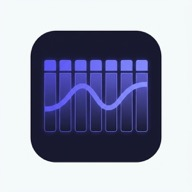

# FlowWeek - Weekly Planner PWA

A minimal, fast, and beautiful weekly planner that works offline. Organize your tasks by day, track progress, and stay focused.



## Features

- 📅 **Weekly View** - See your entire week at a glance (Mon-Sun)
- ✅ **Quick Task Actions** - Mark tasks as Done, Blocked, or Postpone to another day
- 📝 **Quick Dump** - Paste multiple tasks at once, one per line
- 🏷️ **Tags** - Categorize tasks as Work or Personal
- 📱 **Mobile-First** - Responsive design that works on any device
- 🔌 **Offline-First** - Works without internet, all data stored locally
- 📲 **Installable PWA** - Install on your home screen like a native app
- 🌙 **Dark Theme** - Easy on the eyes, beautiful design

## Tech Stack

- **Framework**: Next.js 16 (App Router)
- **Language**: TypeScript
- **Database**: IndexedDB via Dexie.js
- **Styling**: Vanilla CSS with CSS Variables
- **PWA**: Service Worker + Web App Manifest

## Getting Started

### Prerequisites

- Node.js 18+
- npm

### Installation

```bash
# Clone the repository
git clone <your-repo-url>
cd FlowWeek

# Install dependencies
npm install
```

### Development

```bash
npm run dev
```

Open [http://localhost:3000](http://localhost:3000) in your browser.

### Production Build

```bash
# Build for production (static export)
npm run build

# Preview the production build
npx serve out
```

The static files will be exported to the `out/` directory.

## Project Structure

```
FlowWeek/
├── app/
│   ├── globals.css      # Global styles & design system
│   ├── layout.tsx       # Root layout with PWA metadata
│   └── page.tsx         # Main weekly planner page
├── components/
│   ├── AddTask.tsx      # Inline task creation form
│   ├── DayColumn.tsx    # Single day column with tasks
│   ├── QuickDump.tsx    # Bulk task entry modal
│   ├── SettingsDrawer.tsx # Settings panel
│   ├── TaskItem.tsx     # Individual task with actions
│   ├── Toast.tsx        # Notification toasts
│   └── WeekHeader.tsx   # Week navigation header
├── lib/
│   ├── db.ts           # Dexie IndexedDB operations
│   ├── types.ts        # TypeScript type definitions
│   └── week.ts         # ISO week date calculations
└── public/
    ├── icons/          # PWA icons (various sizes)
    ├── manifest.json   # PWA manifest
    └── sw.js          # Service worker
```

## Data Model

### Task

```typescript
interface Task {
  id: string;
  title: string;
  notes?: string;
  tag?: "work" | "personal";
  status: "todo" | "done" | "blocked";
  day: string; // YYYY-MM-DD
  createdAt: number;
  updatedAt: number;
}
```

## Usage

### Adding Tasks

1. Click "+ Add task" on any day
2. Enter a title (required)
3. Optionally add notes and a tag
4. Press Enter or click Add

### Quick Dump

1. Click "Quick Dump" in the header
2. Paste multiple tasks (one per line)
3. Select the target day
4. Click "Add Tasks"

### Task Actions

- **✓ Done** - Marks task complete (strikethrough)
- **⊘ Blocked** - Marks task as blocked (warning style)
- **→ Postpone** - Move to next day or choose a specific day

### Navigation

- Use arrow buttons to navigate between weeks
- Click "Today" to jump back to the current week

### Settings

- **Load Demo Tasks** - Populate with sample tasks for testing
- **Clear All Data** - Remove all tasks (requires confirmation)

## Keyboard Shortcuts

| Key     | Action            |
| ------- | ----------------- |
| Enter   | Submit task form  |
| Escape  | Close modal/form  |
| ⌘+Enter | Submit Quick Dump |

## Offline Support

FlowWeek works completely offline:

- All data is stored in IndexedDB (local browser storage)
- Service worker caches the app for offline access
- No server required

## PWA Installation

### Desktop (Chrome/Edge)

1. Visit the app in your browser
2. Click the install icon in the address bar
3. Click "Install"

### Mobile (iOS)

1. Open in Safari
2. Tap Share button
3. Tap "Add to Home Screen"

### Mobile (Android)

1. Open in Chrome
2. Tap the menu (3 dots)
3. Tap "Add to Home Screen"

## License

MIT

## Contributing

Contributions are welcome! Please feel free to submit a Pull Request.
